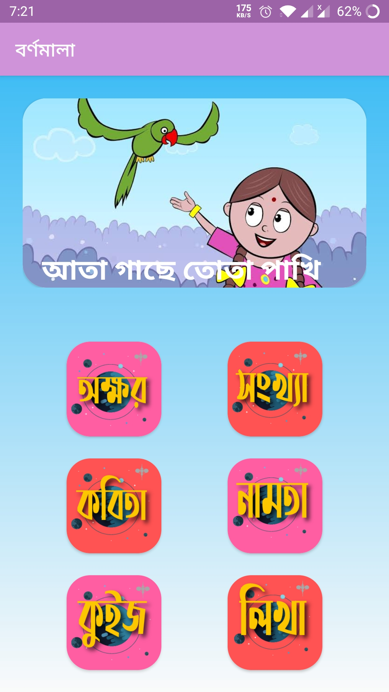

# Bornomala

Bornomala apps made for kites to learn Bangla bornomala easily .

### About this App

* Voice resources act as a fun environment and the Modern UI is very adaptable for children.

## Architecture

The project uses MVVM architecture pattern.

## Libraries 

* [DataBinding](https://developer.android.com/topic/libraries/data-binding) - support library that allows binding of UI components in layouts to data sources,binds character details and search results to UI
* [Navigation Component](https://developer.android.com/guide/navigation/navigation-getting-started) - Android Jetpack's Navigation component helps in implementing
navigation between fragments
* [ViewModel](https://developer.android.com/topic/libraries/architecture/viewmodel/) - Manage UI related data in a lifecycle conscious way and act as a channel between use cases and ui
* [ViewPager2](https://developer.android.com/jetpack/androidx/releases/viewpager2) - to manage multiple fragments for categores 

## App [Link](https://github.com/shaunhossain/Eud-Bangla/releases/download/v0.3-alpha.2/EduBangla.apk)

## Screenshots
|||
|:----:|:----:|
